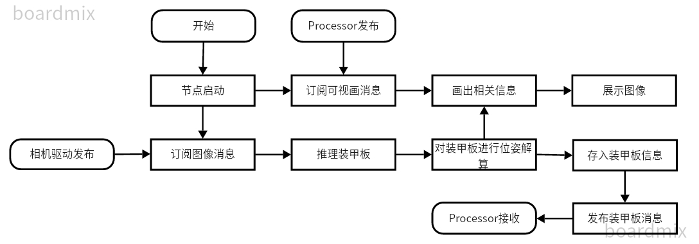

# `armor-detector-node`
自瞄程序的前端，神经网络模型来推理装甲板

## `Brief`
主要用于推理装甲板，架构该节点的宗旨就是简约精悍，把相关参数配置好后，上场前把颜色调好，没有细微的参数调节，大部分时间都不用管它

## `flow chart`

## `Message`
接收image消息，发布装甲板信息，接收state消息进行可视化展示
|    msg   |      type       | topic                |
|    ---   |       ---       |  ---                 |
|   Image  |    Subscriber   | image_raw
|  armors  |     Publisher   | armor_detector/armors_msg
|   state  |    Subscriber   | armor_processor/state_msg

## `Feature`
> - ArmorDetector
>> - config
>>> - info_config.yaml
>>>> - 相机内参矩阵
>>>> - 相机畸变矩阵
>>> - init_config.yaml
>> - model 存放模型
> ---
> - DetectorClass
>> |     file        |     class      | function |
>> |      ---        |     ---        | ---      |
>> | detector_node   | DetectorNode   | 创建节点
>> | armor_detector  | ArmorDetector  | 主要功能类
>> | inference       | Detector       | tup的推理模块
>> | pnp_solver      | PNPSlover      | 装甲板的位姿解算类
---

## `model`
我们根据yolox进行了更改，具体到TUP的仓库中查看

## `other`
### 灰色装甲板识别
逻辑：如果前一帧有(红、蓝)该号的装甲板，就认为这帧识别到的灰色装甲板为打击灰掉的装甲板